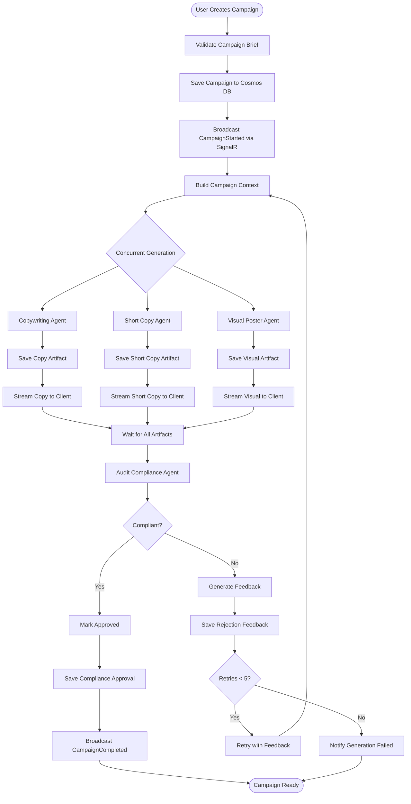
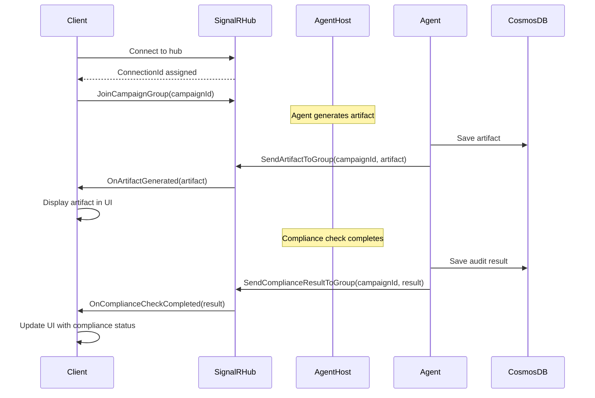
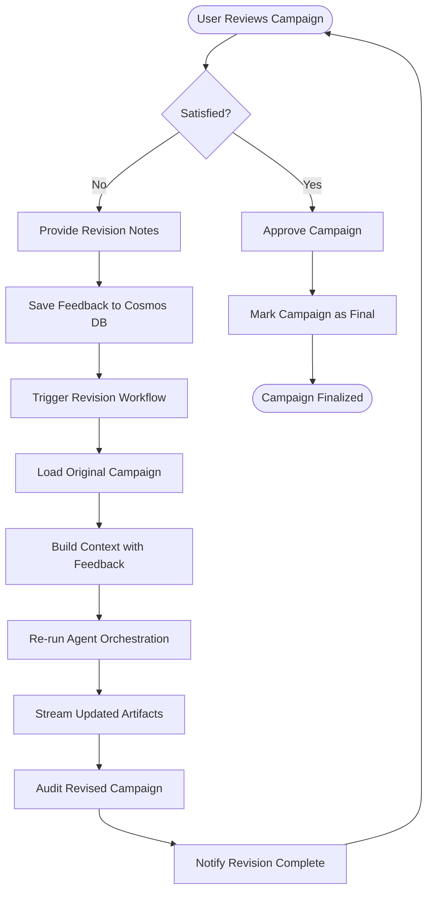
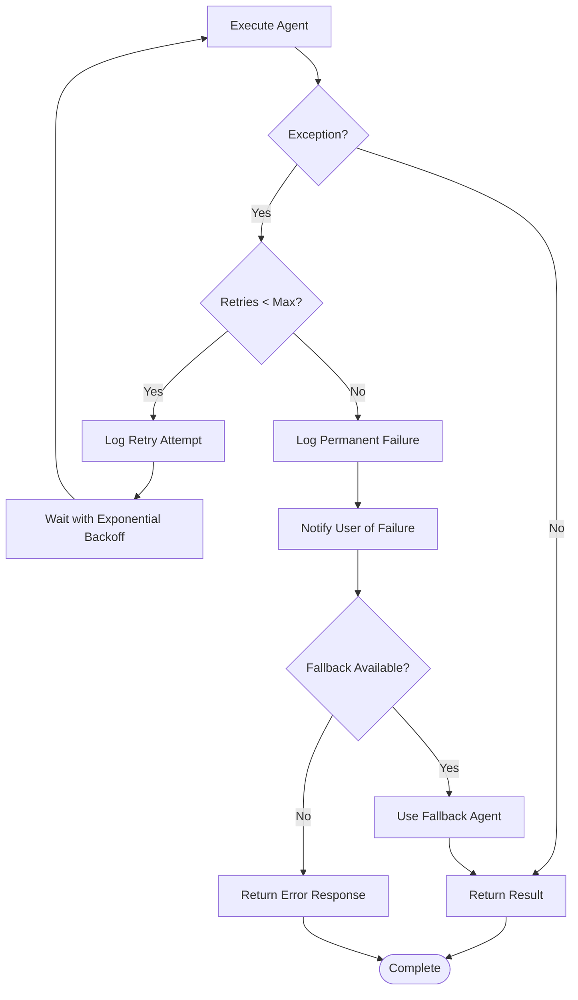

# Data Flow

This document describes the detailed data flows within the Marketing Agents Platform, covering campaign generation, artifact streaming, compliance auditing, and feedback iterations.

## Campaign Generation Data Flow

### Overview

When a user creates a new campaign, the system orchestrates multiple AI agents to generate a complete set of marketing artifacts. This flow demonstrates the sequential and concurrent execution patterns.

### Detailed Flow



### Data Transformations

#### 1. Campaign Brief → Agent Context
**Input** (from user):
```json
{
  "theme": "Summer Product Launch",
  "product": "EcoBottle - Sustainable Water Bottle",
  "targetAudience": "Environmentally conscious millennials",
  "tone": "Inspirational and eco-friendly",
  "constraints": ["Must include recycling message", "Avoid plastic-related claims"]
}
```

**Transformation** (to agent context):
```csharp
var context = $@"
Campaign Theme: {brief.Theme}
Product: {brief.Product}
Target Audience: {brief.TargetAudience}
Tone: {brief.Tone}
Constraints: {string.Join(", ", brief.Constraints)}
Previous Feedback: {rejectionFeedback ?? "None"}
";
```

#### 2. Agent Response → Artifact Model
**Agent Output**:
```json
{
  "content": "Discover the EcoBottle: your daily hydration companion...",
  "metadata": {
    "wordCount": 650,
    "tone": "inspirational",
    "keywords": ["sustainable", "eco-friendly", "recycling"]
  }
}
```

**Artifact Model**:
```csharp
public record CampaignArtifact
{
    public string Id { get; init; }
    public string CampaignId { get; init; }
    public ArtifactType Type { get; init; } // Copy, ShortCopy, Visual
    public string Content { get; init; }
    public Dictionary<string, object> Metadata { get; init; }
    public DateTimeOffset CreatedAt { get; init; }
    public string AgentName { get; init; }
}
```

#### 3. Compliance Check → Audit Result
**Audit Agent Input**:
```json
{
  "artifacts": [
    {"type": "Copy", "content": "..."},
    {"type": "ShortCopy", "content": "..."},
    {"type": "Visual", "content": "..."}
  ],
  "brandGuidelines": {...},
  "regulatoryRules": {...}
}
```

**Audit Result**:
```csharp
public record ComplianceAuditResult
{
    public bool IsCompliant { get; init; }
    public int ComplianceScore { get; init; } // 0-100
    public List<ComplianceIssue> Issues { get; init; }
    public string Feedback { get; init; }
}

public record ComplianceIssue
{
    public string ArtifactType { get; init; }
    public string IssueDescription { get; init; }
    public SeverityLevel Severity { get; init; }
}
```

## Real-Time Artifact Streaming

### SignalR Event Flow



### SignalR Hub Methods

#### Server → Client Events

```typescript
// Frontend TypeScript client interface
interface ICampaignHub {
  // Invoked by server
  onCampaignStarted(campaignId: string): void;
  onArtifactGenerated(artifact: CampaignArtifact): void;
  onComplianceCheckCompleted(result: ComplianceAuditResult): void;
  onCampaignCompleted(campaignId: string): void;
  onGenerationFailed(campaignId: string, error: string): void;
}
```

#### Client → Server Methods

```csharp
// Backend C# hub interface
public interface ICampaignHub
{
    Task JoinCampaignGroup(string campaignId);
    Task LeaveCampaignGroup(string campaignId);
    Task RequestCampaignStatus(string campaignId);
}
```

## Feedback Iteration Flow

### Revision Request Data Flow



### Revision Context Structure

```csharp
public record RevisionContext
{
    public string OriginalCampaignId { get; init; }
    public int RevisionNumber { get; init; }
    public string UserFeedback { get; init; }
    public List<string> SpecificChanges { get; init; }
    public List<CampaignArtifact> PreviousArtifacts { get; init; }
}
```

**Example Revision Prompt**:
```
Original Campaign Theme: Summer Product Launch
Original Copy: "Discover the EcoBottle: your daily hydration companion..."

User Feedback: "Make the tone more energetic and youthful. Emphasize the adventure aspect."

Specific Changes Requested:
- Add references to outdoor activities
- Include more vibrant language
- Shorten the introduction

Please regenerate the copy incorporating this feedback while maintaining brand consistency.
```

## Database Query Patterns

### Cosmos DB Queries

#### Retrieve Campaign with Artifacts
```csharp
var container = cosmosClient.GetContainer("marketing", "campaigns");

// Efficient query using partition key
var query = container.GetItemLinqQueryable<Campaign>(
    requestOptions: new QueryRequestOptions
    {
        PartitionKey = new PartitionKey(campaignId)
    })
    .Where(c => c.Id == campaignId);

var campaign = await query.ToFeedIterator().ReadNextAsync();
```

#### Stream Artifacts by Type
```csharp
var container = cosmosClient.GetContainer("marketing", "artifacts");

// Query artifacts by campaign and type
var query = container.GetItemLinqQueryable<CampaignArtifact>(
    requestOptions: new QueryRequestOptions
    {
        PartitionKey = new PartitionKey(campaignId)
    })
    .Where(a => a.Type == ArtifactType.Copy)
    .OrderByDescending(a => a.CreatedAt);

await foreach (var artifact in query.ToFeedIterator())
{
    // Process artifact
}
```

### Redis Caching Patterns

#### Cache Agent Response
```csharp
var cacheKey = $"agent:{agentName}:response:{contextHash}";
var cachedResponse = await redis.StringGetAsync(cacheKey);

if (!cachedResponse.IsNullOrEmpty)
{
    return JsonSerializer.Deserialize<AgentResponse>(cachedResponse);
}

// Generate response via agent
var response = await agent.RunAsync(context);

// Cache for 1 hour
await redis.StringSetAsync(cacheKey, JsonSerializer.Serialize(response), TimeSpan.FromHours(1));

return response;
```

## Error Handling & Retry Logic

### Agent Execution Error Flow



### Retry Configuration

```csharp
var retryPolicy = Policy
    .Handle<HttpRequestException>()
    .Or<TimeoutException>()
    .WaitAndRetryAsync(
        retryCount: 5,
        sleepDurationProvider: attempt => TimeSpan.FromSeconds(Math.Pow(2, attempt)),
        onRetry: (exception, timespan, retryCount, context) =>
        {
            logger.LogWarning("Retry {RetryCount} after {Delay}s due to {Exception}",
                retryCount, timespan.TotalSeconds, exception.GetType().Name);
        });

await retryPolicy.ExecuteAsync(async () =>
{
    return await agent.RunAsync(prompt);
});
```

## Performance Optimization

### Concurrent Agent Execution

```csharp
// Execute independent agents in parallel
var copyTask = copyAgentProvider.GenerateCopyAsync(context);
var shortCopyTask = shortCopyAgentProvider.GenerateShortCopyAsync(context);
var visualTask = visualAgentProvider.GenerateVisualAsync(context);

// Wait for all to complete
await Task.WhenAll(copyTask, shortCopyTask, visualTask);

// Gather results
var artifacts = new List<CampaignArtifact>
{
    await copyTask,
    await shortCopyTask,
    await visualTask
};
```

### Streaming Large Responses

```csharp
// Stream agent response as it's generated
await foreach (var chunk in agent.StreamAsync(prompt))
{
    await signalRHub.Clients.Group(campaignId).SendAsync("OnChunkReceived", chunk);
}
```

## Next Steps

- [System Design](system-design.md) - Component architecture
- [Development Workflow](../guides/development.md) - Build features
- [API Documentation](../api/rest-api.md) - API reference
