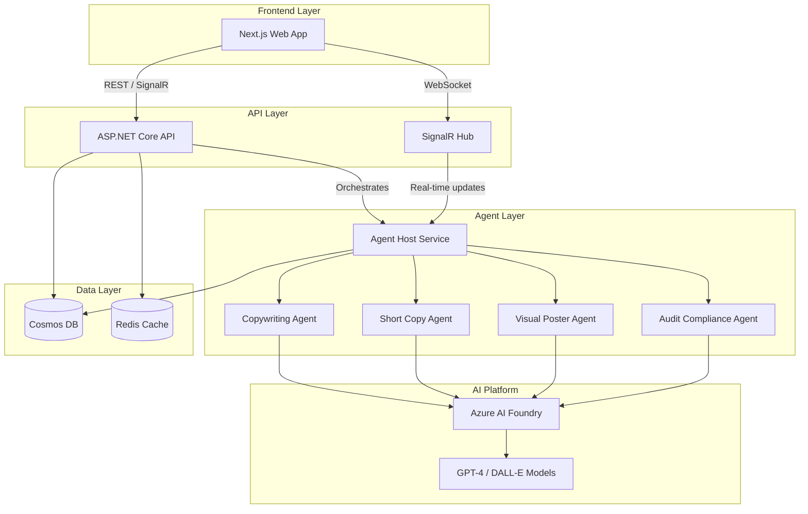
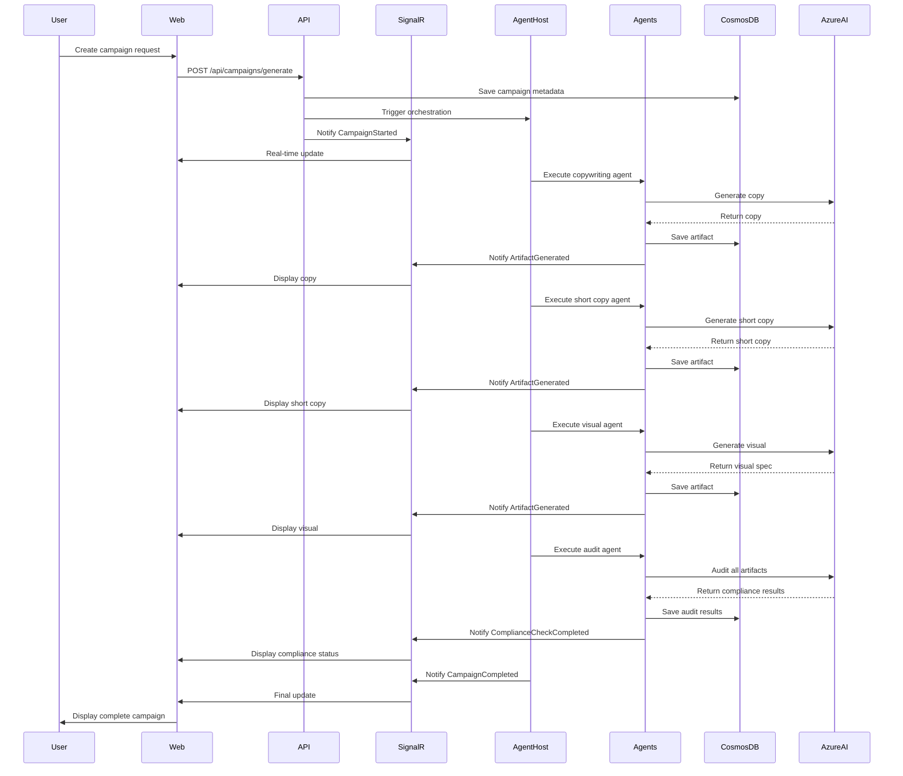

# System Design

This document describes the detailed system design of the Marketing Agents Platform, including component interactions, data models, and technical architecture.

## System Architecture

The Marketing Agents Platform follows a cloud-native, microservices-inspired architecture with the following key components:

## Component Descriptions

### Frontend Layer

#### Next.js Web App
- **Technology**: Next.js 14 with App Router, React 18, TypeScript
- **Purpose**: User interface for creating and managing marketing campaigns
- **Key Features**:
  - Server Components for SEO and performance
  - Client Components for interactivity
  - Real-time updates via SignalR
  - Responsive design with Tailwind CSS

### API Layer

#### ASP.NET Core API
- **Technology**: .NET 9, ASP.NET Core Minimal APIs
- **Purpose**: RESTful API for campaign management and orchestration
- **Endpoints**:
  - `/api/campaigns` - CRUD operations for campaigns
  - `/api/campaigns/{id}/generate` - Trigger campaign generation
  - `/api/campaigns/{id}/artifacts` - Retrieve generated artifacts
  - `/health` - Health check endpoint
- **Responsibilities**:
  - Request validation and authentication
  - Campaign lifecycle management
  - Agent orchestration coordination
  - Data persistence

#### SignalR Hub
- **Technology**: ASP.NET Core SignalR
- **Purpose**: Real-time bidirectional communication
- **Events**:
  - `CampaignStarted` - Generation initiated
  - `ArtifactGenerated` - New artifact available
  - `ComplianceCheckCompleted` - Audit results ready
  - `CampaignCompleted` - All artifacts generated
- **Features**:
  - Automatic reconnection
  - Backpressure handling
  - Typed hub contracts

### Agent Layer

#### Agent Host Service
- **Technology**: .NET 9, Microsoft Agent Framework
- **Purpose**: Host and orchestrate AI agents
- **Architecture Pattern**: Agent providers with dependency injection
- **Orchestration Modes**:
  - **Sequential**: Agents execute one after another (copy → short copy → visual → audit)
  - **Concurrent**: Independent agents execute in parallel (copy + short copy + visual)
- **Responsibilities**:
  - Agent lifecycle management
  - Tool registration and execution
  - Retry logic with compliance feedback
  - State management and persistence

#### Specialized Agents

**Copywriting Agent**
- Generates long-form marketing copy
- Tools: Theme validation, brand voice analysis, content structure optimization
- Output: Full campaign copy (400-800 words)

**Short Copy Agent**
- Creates concise social media and ad copy
- Tools: Character count validation, hashtag optimization, CTA generation
- Output: Multiple short-form variants (50-150 characters)

**Visual Poster Agent**
- Designs visual concepts and poster layouts
- Tools: Color palette selection, layout optimization, brand asset integration
- Output: Visual design specifications and DALL-E prompts

**Audit Compliance Agent**
- Reviews all artifacts for compliance
- Tools: Brand guideline validation, regulatory compliance checks, tone analysis
- Output: Approval status, rejection feedback, compliance score

### Data Layer

#### Cosmos DB
- **Purpose**: Primary data store for campaigns, artifacts, and audit logs
- **Partitioning Strategy**: Partition by campaign ID for optimal query performance
- **Containers**:
  - `campaigns` - Campaign metadata and configuration
  - `artifacts` - Generated artifacts (copy, visuals, etc.)
  - `audit-logs` - Compliance check history
- **Consistency Level**: Session (default) for balance of consistency and performance

#### Redis Cache
- **Purpose**: Cache frequently accessed data, session state
- **Use Cases**:
  - Agent response caching
  - Rate limiting counters
  - Real-time session tracking

### AI Platform

#### Azure AI Foundry
- **Purpose**: Host LLM models and agent runtime
- **Models Used**:
  - GPT-4 for copywriting and compliance
  - DALL-E 3 for visual generation
- **Features**:
  - Prompt asset management
  - Safety routing and content filtering
  - Evaluation datasets

## Data Flow

### Campaign Generation Flow

## Security Architecture

### Authentication & Authorization
- **Authentication**: Azure AD / Microsoft Entra ID
- **Authorization**: Role-based access control (RBAC)
- **Secrets Management**: Azure Key Vault for production, User Secrets for local development

### Data Protection
- **Encryption at Rest**: Cosmos DB automatic encryption
- **Encryption in Transit**: TLS 1.3 for all communications
- **PII Handling**: Data classification and region-specific storage

### API Security
- **Rate Limiting**: Redis-backed rate limiting (100 requests/minute per user)
- **Input Validation**: FluentValidation for request validation
- **CORS**: Configured for approved origins only

## Scalability Considerations

### Horizontal Scaling
- **API Service**: Stateless, scales horizontally via Azure Container Apps
- **Agent Host**: Distributed agent execution with message queuing (future)
- **Database**: Cosmos DB auto-scales based on RU consumption

### Performance Optimization
- **Caching**: Redis for frequently accessed data
- **Connection Pooling**: HTTP client factory with connection pooling
- **Async/Await**: All I/O operations are asynchronous

### Monitoring & Observability
- **OpenTelemetry**: Distributed tracing across all services
- **Application Insights**: Logs, metrics, and traces
- **Health Checks**: Kubernetes-style health endpoints

## Deployment Architecture

### Local Development (.NET Aspire)
- Orchestrates all services locally
- Automatic service discovery
- Integrated Aspire dashboard

### Production (Azure Container Apps)
- Each service deployed as independent container
- Azure-managed infrastructure
- Auto-scaling based on load
- Integrated with Azure Monitor

## Technology Decisions

### Why .NET Aspire?
- Simplifies local development orchestration
- Built-in service discovery and observability
- Smooth path from local to cloud deployment

### Why Cosmos DB?
- Global distribution capabilities
- Flexible schema for evolving artifact types
- Strong consistency guarantees when needed
- Native Azure integration

### Why SignalR?
- Native .NET integration
- Automatic reconnection and fallback
- Strongly-typed hubs with TypeScript support
- WebSocket with Server-Sent Events fallback

### Why Microsoft Agent Framework?
- First-class Azure AI Foundry integration
- Built-in tool/skill support
- Prompt asset management
- Safety and compliance features

## Next Steps

- [Data Flow Details](data-flow.md) - In-depth data flow diagrams
- [Architecture Decisions](decisions.md) - ADRs documenting key choices
- [Deployment Guide](../guides/deployment.md) - Deploy to Azure
